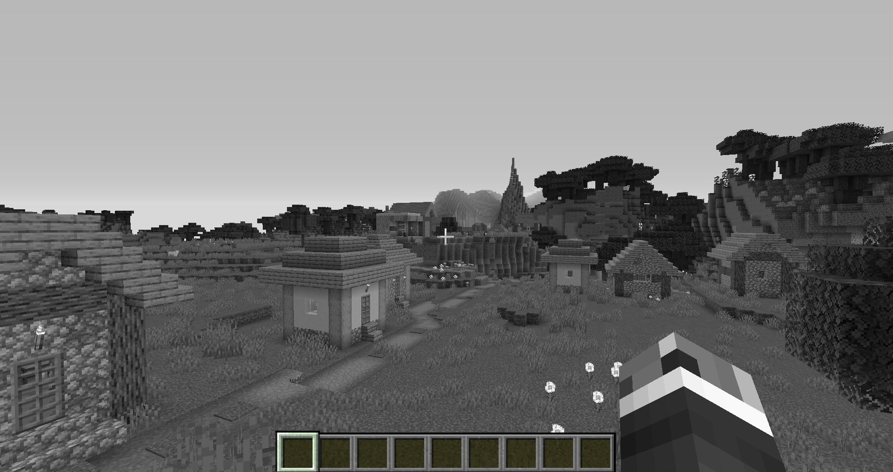

# Tutorial 1

In this tutorial we explore the most basic fullscreen pass: The final pass.

## Basic file structure of a shader

Before we start learning about `final`, we need to understand the basic file structure of a shader pack. Within a shader pack, there is a folder called "shaders". This is where all the shader files goes. The files have the extension `.vsh` for vertex shaders or `.fsh` for fragment shaders. The shader file name corresponds to a shader program name. For example, `final.vsh` and `final.fsh` are part of the `final` shader program.

To create your own shader, first create a folder. The name of the folder is the name you want to give your shader. Then inside that folder, create another folder called "shaders". Within `shaders`, you can start creating the shader files. If you are confused about file structure of a shader pack, you can always look at another shader pack for reference.

## What is final?

final is a fullscreen pass. It is the last pass in the shader pipeline. Whatever color final outputs is the color that gets displayed on your screen. Here, you can do certain post processing effects like bluring, tone mapping, or gamma correction.

## What other fullscreen passes are there?

In Optifine, there are 3 types of fullscreen passes. They are called `deferred`, `composite`, and `final`. `final` is the fullscreen pass we just covered. `deferred` and `compsite` are fullscreen passes we will cover in later tutorials.

## Show me the code

We will be implementing a basic shader that converts the colors on your screen to grayscale. Let's start off with the vertex shader. We first start with the version declratation. We will be using GLSL version 120

```glsl
#version 120
```

Since `final` is a fullscreen pass, we need to pass a texture coordinate into the fragment shader so we can read from the pixels from the screen.

```glsl
varying vec2 TexCoords;
```

Now we head into the `main` function of the vertex shader.

```glsl
void main() {
   gl_Position = ftransform();
   TexCoords = gl_MultiTexCoord0.st;
}
```

If you have never seen `ftransform` or `gl_MultiTexCoord0` before, don't worry. They are part of the old versions of the GLSL shading language. `ftransform` basically expands to `gl_ModelViewProjectionMatrix * gl_Vertex`. `gl_Vertex` is the in-built vertex attribute.`gl_ModelViewProjectionMatrix` is the in-build model view projection matrix. Since `gl_Vertex` is probably in clip space already, `gl_ModelViewProjectionMatrix` is the identity matrix. `gl_MultiTexCoord0` is the in-built texture coordinate attribute. If you are wondering, yes, there is `gl_MultiTexCoord1`, `gl_MultiTexCoord2`, etc. We will look into using `gl_MultiTexCoord1` later. `gl_MultiTexCoord2` and higher are usually not used. In built texture coordinates are `vec4`, which is why we have to add `.st` at the end.

End the end your vertex shader looks like this:

```glsl
#version 120

varying vec2 TexCoords;

void main() {
   gl_Position = ftransform();
   TexCoords = gl_MultiTexCoord0.st;
}
```

After the vertex shader comes the fragment shader. We start off by declaring the GLSL version and accepting the texture coordinate output from the vertex shader.

```glsl
#version 120

varying vec2 TexCoords;
```

Since final is a fullscreen pass, we need to sample the screen's color from somewhere. Since we have not defined any other program besides final, Optifine will use it's internal shader for the missing programs. The internal shader is basically a reimplementation of the vanilla shaders in the shader pipeline. The internal shaders outputs it's color to a texture called `colortex0`.

```glsl
uniform sampler2D colortex0;
```

Now we enter the `main` function:

```glsl
void main() {
    // Sample the color
   vec3 Color = texture2D(colortex0, TexCoords).rgb;
   // Convert to grayscale
   Color = vec3(dot(Color, vec3(0.333f)));
   // Output the color
   gl_FragColor = vec4(Color, 1.0f);
}
```

Let's break it down line by line. We first sample `colortex0` using our texture coordinate. We use the function `texture2D` here since that is how you sampled from a 2D texture in old versions of GLSL. More modern versions have replaced this function with `texture`, however, that is not available in GLSL 120. We then convert the color to grayscale using `dot(Color, vec3(0.333f))` which is mathematically equivalent to `Color.r * 0.333f + Color.g * 0.333f + Color.b * 0.333f`. Then we finally output the color to `gl_FragColor`.

In the end, your fragment shader should be this:

```glsl
#version 120

varying vec2 TexCoords;

uniform sampler2D colortex0;

void main() {
   // Sample the color
   vec3 Color = texture2D(colortex0, TexCoords).rgb;
   // Convert to grayscale
   Color = vec3(dot(Color, vec3(0.333f)));
   // Output the color
   gl_FragColor = vec4(Color, 1.0f);
}
```

Here is the results of the shader:



Although it is not much, it's definitely a start on your shader programming journey! In the next tutorial, we will do some block rendering and learn about `composite`, which is the other fullscreen pass I mentioned.
