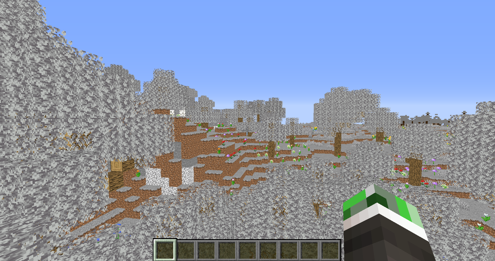
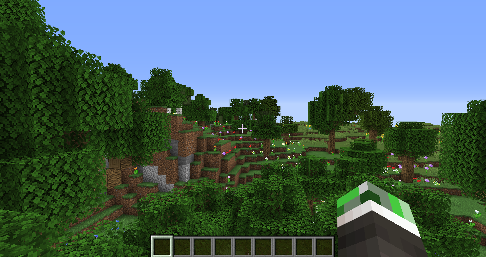
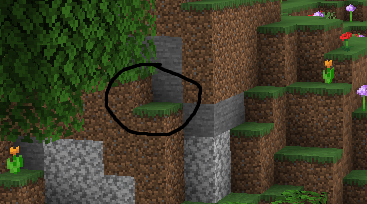
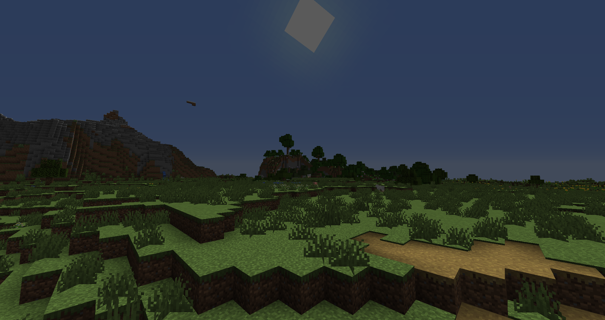

# Tutorial 2

Today we will explore the gbuffers and composite shader programs, and we will use our new knowledge to implement basic diffuse lighting

## What is gbuffers?

The gbuffers programs are the main geometry passes. In gbuffers, you can render entities, particals, blocks, etc from the point of view of the player. There are different types of gbuffers programs. For example, `gbuffers_terrain` renders blocks like stone and dirt, while `gbuffers_entities` renders entities like mobs and chests. In gbuffers you can use them for forward rendering or use them as the gbuffers stage in a deferred rendering pipeline.

## What is compsite?

The composite programs are fullscreen passes that run after all the gbuffers programs have finished executing. There are 15 of them, going from `composite`, `composite1`, `composite2`, `compositeN`, `composite15`. In the composite programs, you can do things like deferred lighting and post processing.

## The color textures and concept of drawbuffers

In the entire part of the shader pipeline from gbuffers to composite, you have 8 color textures to fiddle with. You can sample from them and write to them. Do note that these are the same 8 color textures no matter which part of the pipeline you are in. For example, if I wrote the albedo color to color texture 1 in `gbuffers_terrain`, and then sampled from it in `composite`, I would get the albedo color of the block. You can also use this feature to move data between shader stages. For example, if I wrote the color `vec3(0.5f)` to color texture 2 in `composite`, I would get the same color if I sampled from it in `composite1`. To select which color textures you want to write to, use the following comment somewhere in the fragment shader:

```glsl
/* DRAWBUFFERS:NNNN */
```

Here N coressponds to a buffer index, which is basically which color texture you want to render to. You don't have to have exactly 4 render targets, but you must at least have 1. Here is an example we are going to use in our shader today:

```glsl
/* DRAWBUFFERS:01 */
```

This allows me to write to color textures 0 and 1. To actually write to the color textures from the shader, you can use `gl_FragData`. Here is another example:

```glsl
/* DRAWBUFFERS:37 */
gl_FragData[0] = SomethingToWriteToColorTexture3;
gl_FragData[1] = SomethingToWriteToColorTexture7;
```

You can also specify the format of color textures like so:

```glsl
const int RGBA16 = 1;
const int RGBA32F = 1;

const int colortex2Format = RGBA16;
const int colortex4Format = RGBA32F;
```

See the Optifine docuementation for the full list of availble color texture formats.

### Color texture names

In old shader code, you might see this:

```glsl
// The legacy names
uniform sampler2D gcolor;    // color texture 0
uniform sampler2D gdepth;    // color texture 1
uniform sampler2D gnormal;   // color texture 2
uniform sampler2D composite; // color texture 3
uniform sampler2D gaux1;     // color texture 4
uniform sampler2D gaux2;     // color texture 5
uniform sampler2D gaux3;     // color texture 6
uniform sampler2D gaux4;     // color texture 7
```

In more modern shader code you would see this:

```glsl
uniform sampler2D colortex0; // color texture 0
uniform sampler2D colortex1; // color texture 1
uniform sampler2D colortex2; // color texture 2
uniform sampler2D colortex3; // color texture 3
uniform sampler2D colortex4; // color texture 4
uniform sampler2D colortex5; // color texture 5
uniform sampler2D colortex6; // color texture 6
uniform sampler2D colortex7; // color texture 7
```

I will not be using the legacy names in my tutorials.

## Show me the code

Create a new shader pack. We do not want to keep the old grayscale code from the previous tutorial. Let's start off with the vertex shader of `gbuffers_terrain`.

```glsl
#version 120

varying vec2 TexCoords;
varying vec3 Normal;

void main() {
    gl_Position = ftransform();
    TexCoords = gl_MultiTexCoord0.st;
    Normal = gl_NormalMatrix * gl_Normal;
}
```

We first declare 2 `varying` variables, which are our normal vector and our texture coordinates. In the `main` function, we transform our vertex, and assign values to our texture coordinates and normal vector. `gl_Normal` is an in-built `attribute` variable representing the world space normal vector. However, we have to transform our normal from world space to view space since most of our calculations are done in view space. We will see why that is later. We do the normal transformation using an in-built `uniform` variabled called the `gl_NormalMatrix`.

Let's take a look at the fragment shader.

```glsl
#version 120

varying vec2 TexCoords;
varying vec3 Normal;

uniform sampler2D texture;

void main(){
    vec4 albedo = texture2D(texture, TexCoords);
    /* DRAWBUFFERS:01 */
    gl_FragData[0] = albedo;
    gl_FragData[1] = vec4(Normal * 0.5f + 0.5f, 1.0f);
}
```

Here, we specify our drawbuffers and write to them. In draw buffer index 0, we write the albedo color, and in index 1 we write the normal. We have to move our normal vector to the [0, 1] range since our color textures are going to have an unsigned integer format. I could use an signed integer format, but that is only availble in newer versions of Optifine, and floating point formats are either going to be way too large or will not have enough precision. If we run our shader as is to make sure everything is working, we run into a problem:



This problem occurs because the textures of blocks like grass and leaves are stored as gray scale on the texture atlas. These values are expected to be multipled by a per-vertex color attribute representing biome color. Here are our fixed vertex and fragment shaders.

Vertex shader:

```glsl
#version 120

varying vec2 TexCoords;
varying vec3 Normal;
varying vec4 Color;

void main() {
    // Transform the vertex
    gl_Position = ftransform();
    // Assign values to varying variables
    TexCoords = gl_MultiTexCoord0.st;
    Normal = gl_NormalMatrix * gl_Normal;
    Color = gl_Color;
}
```

Fragment shader:

```glsl
#version 120

varying vec2 TexCoords;
varying vec3 Normal;
varying vec4 Color;

// The texture atlas
uniform sampler2D texture;

void main(){
    // Sample from texture atlas and account for biome color + ambien occlusion
    vec4 albedo = texture2D(texture, TexCoords) * Color;
    /* DRAWBUFFERS:01 */
    // Write the values to the color textures
    gl_FragData[0] = albedo;
    gl_FragData[1] = vec4(Normal * 0.5f + 0.5f, 1.0f);
}
```

`gl_Color` is an in-built attribute variable that, in this case, represents block color. For vegitation blocks, this is the biome color. For non-vegitative blocks, this is just `vec4(1.0f)`. Here is the result of our fix:



Everything is looking much nicer now. We also get free ambient occlusion by doing this:



Look closely at the places where a corner is formed by the intersection of blocks. You will notice that it looks a bit darker. This is because the color ends up getting darkened in occluded spots. One thing to note is that both the block color and texture atlas have display gamma baked into them. That is, if you want to do any lighting calculations on them, you have to convert your albedo from gamma sRGB to linear sRGB. We will do that in `composite`.

Speaking of `composite`, let's look at the vertex shader `composite.vsh:

```glsl
#version 120

varying vec2 TexCoords;

void main() {
   gl_Position = ftransform();
   TexCoords = gl_MultiTexCoord0.st;
}
```

This is pretty much a copy-paste of our `final.vsh` vertex shader from the previous tutorial. The fragment shader is different however:

```glsl
#version 120

varying vec2 TexCoords;

// Direction of the sun (not normalized!)
uniform vec3 sunPosition;

// The color textures which we wrote to
uniform sampler2D colortex0;
uniform sampler2D colortex1;

/*
const int colortex0Format = RGBA16;
const int colortex1Format = RGBA16;
*/

const float sunPathRotation = -40.0f;

const float Ambient = 0.1f;

void main(){
    // Account for gamma correction
    vec3 Albedo = pow(texture2D(colortex0, TexCoords).rgb, vec3(2.2f));
    // Get the normal
    vec3 Normal = normalize(texture2D(colortex1, TexCoords).rgb * 2.0f - 1.0f);
    // Compute cos theta between the normal and sun directions
    float NdotL = max(dot(Normal, normalize(sunPosition)), 0.0f);
    // Do the lighting calculations
    vec3 Diffuse = Albedo * (NdotL + Ambient);
    /* DRAWBUFFERS:0 */
    // Finally write the diffuse color
    gl_FragData[0] = vec4(Diffuse, 1.0f);
}
```

`sunPosition` here is the direction of the sun. `colortex0` and `colortex1` are the color textures we wrote to in `gbuffers_terrain`. After that we define out color texture formats. We will be using `RGBA16`. Notice how it was declared as a comment. It still works this way. After that, `sunPathRotation` is a variable Optifine reads. It describes how titled the sun is from an overhead path in degrees. `Ambient` is an ambient lighting factor we will use in our lighting calculations. Now we reach `main`. We first sample the albedo and then account for gamma correction. We also sample the normal and bring it back to teh [-1, 1] range. I normalize it jsut be sure it is a unit vector. Then I compute the dot product between the normal vector and the sun direction. For some reason, `sunPosition` is not a unit vector so I have to normalize it. Then I compute the lighting value and write to drawbuffer 0. Then this value gets read by `final`, and it gets gamma corrected and written to the screen. Here is what our shader looks like now:



Notice how blocks facing away from the sun are lit less that those that are. Also notice how the sky looks completely broken. This is because `composite` is a fullscreen pass and that doesn't mean it does not run for the sky as well. We will fix this bug in a later tutorial. In the next tutorial we will look at using the lightmap to account for both torch and sky lighting, and we will add shadows to our shaders.
