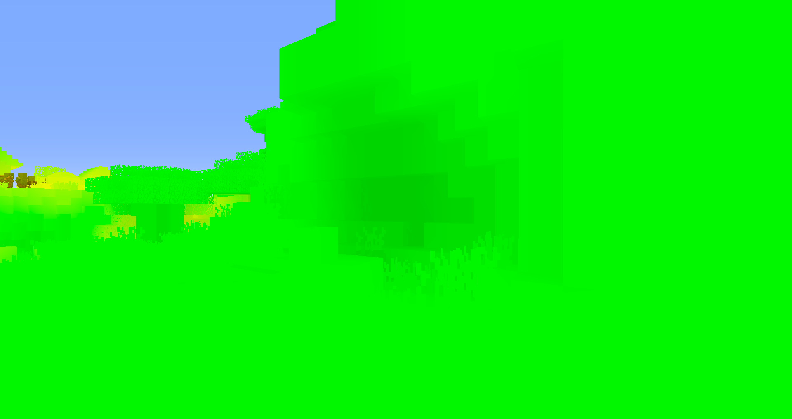
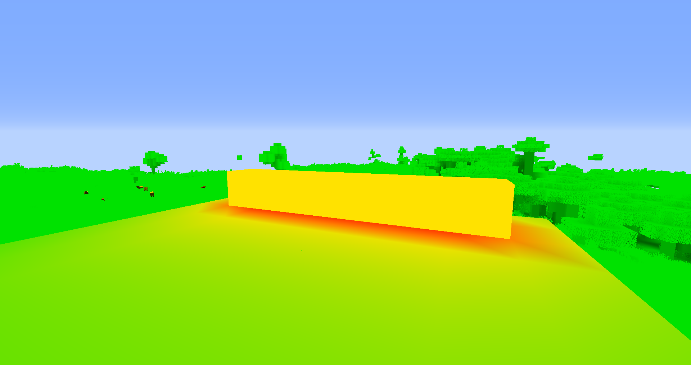
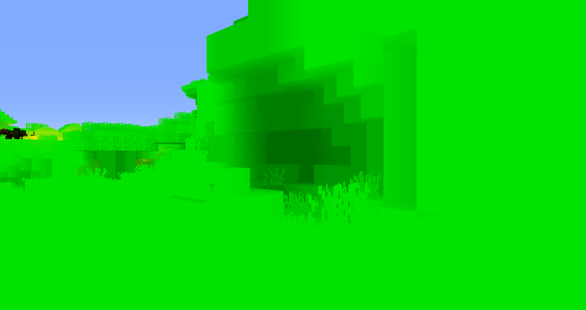
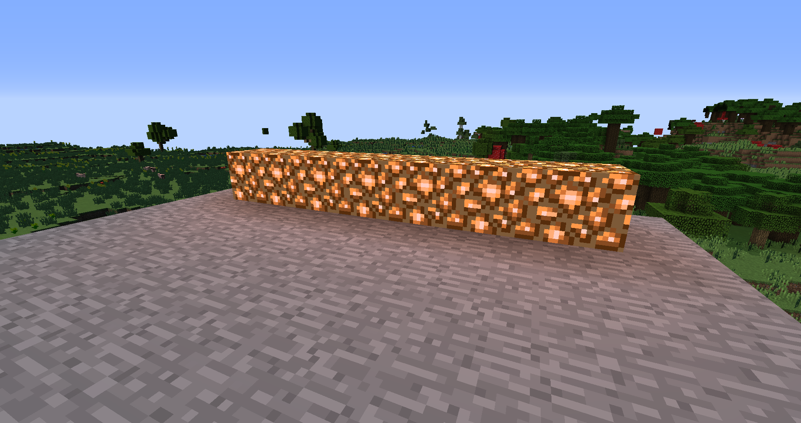
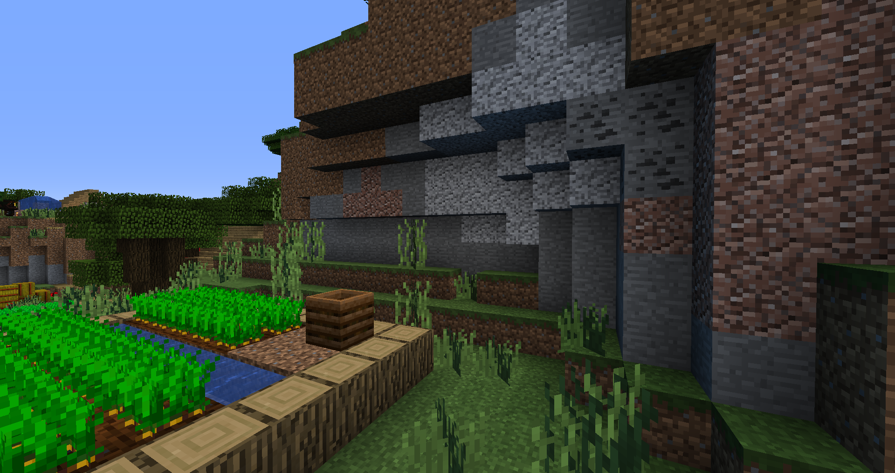
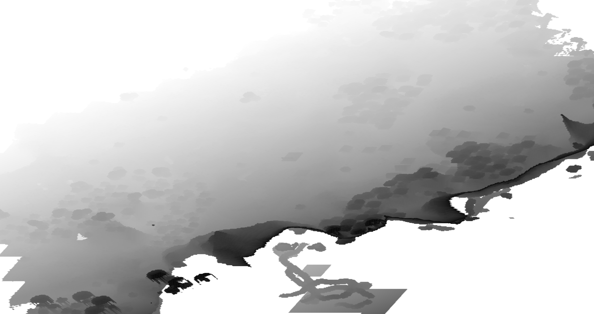
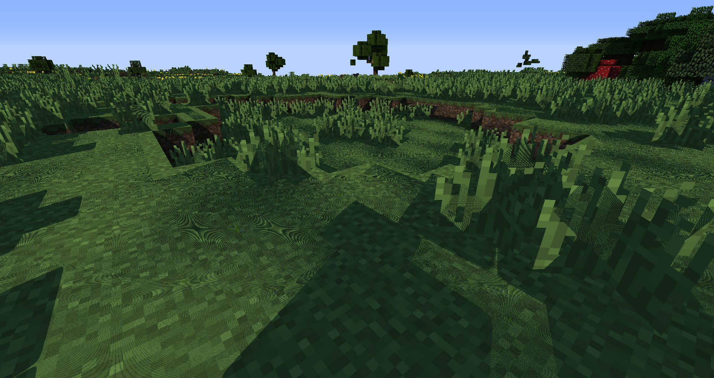
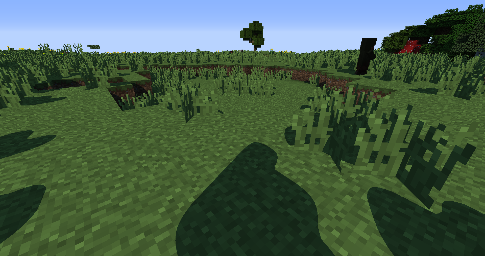
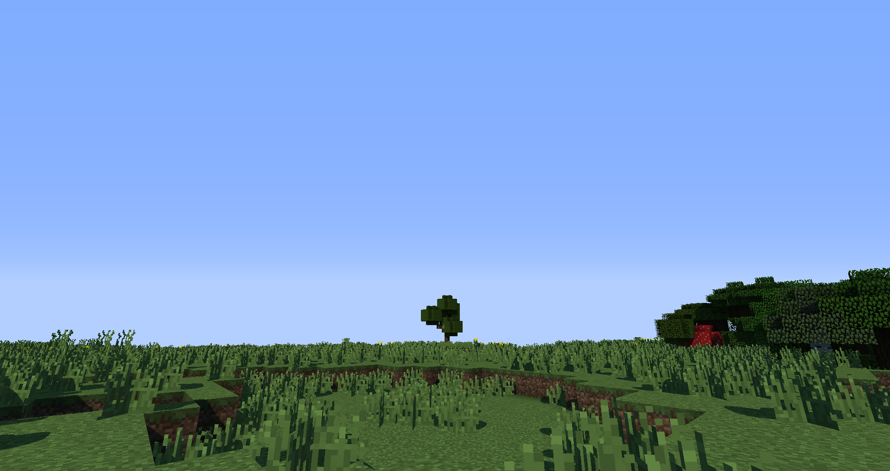

# Tutorial 3

In this tutorial we will look at implementing the lightmap and shadows.

## The lightmap

In the gbuffers vertex shader, the lightmap is accesible by using `gl_MultiTexCoord1`. The `s` channel is the torch lightmap, and the `t` channel is the sky lightmap..However this value is not in the range [0, 1]. Instead it is in the range [0, 15], but that can change depending on the version of Minecraft you are playing on. Thankfully, if we multiply our lightmap by `gl_TextureMatrix[1]` to move it into the range [0, 1]. Well actually, not quite that range. It gets moved into the range [1.05 / 32, 32/33.05]. We can do some quick math to get it into the range [0, 1]. We have to also declare a new varying variable, `LightmapCoords`, to move the lightmap values from the vertex shader to the fragment shader. It looks something like this:

```glsl
varying vec2 LightmapCoords;

[...]

void main() {
    [...]
    // Use the texture matrix instead of dividing by 15 to maintain compatiblity for each version of Minecraft
    LightmapCoords = mat2(gl_TextureMatrix[1]) * gl_MultiTexCoord1.st;
    // Transform them into the [0, 1] range
    LightmapCoords = (LightmapCoords * 33.05f / 32.0f) - (1.05f / 32.0f);
    [...]
}
```

And in the fragment shader, we have to write the values to a color texture:

```glsl
varying vec2 LightmapCoords;
[...]

void main() {
    [...]
    /* DRAWBUFFERS:012 */
    // Write the values to the color textures
    gl_FragData[0] = albedo;
    gl_FragData[1] = vec4(Normal * 0.5f + 0.5f, 1.0f);
    gl_FragData[2] = vec4(LightmapCoords, 0.0f, 1.0f);
}

```

Then in compsite we read back the lightmap values like so:

```glsl
vec2 Lightmap = texture2D(colortex2, TexCoords).rg;
```

Remember, we are now using a new color texture, `colortex2`. We have to set it's format and declare it. I use `RGB16` for the format since we don't need the alpha channel. Also a small change from the last tutorial: I made a mistake and set the normal color texture format to `RGBA16`. This is wrong since we don't use the alpha channel, so it should instead, like the lightmap color texture, be `RGB16`. The reason why I keep the blue channel in the lightmap instead of using `RG16` is because in the next upcoming tutorials, we will make use of that space to store material masks and whatnot.

If we visualise the lightmap, we see something like this:




As you can see, in the first screenshot, while looking at glowstone, the lightmap looks more redder since there is a higher torch lighting value there. In the second screenshot, the part under the overhang thing looks darker since there is not torch light map and those blocks have less exposure to the sky. This may look good, but the rate at which the lightmap attenuates is not very realistic. We will have to modify the lightmap with out own functions. I will be using these:

```glsl
float AdjustLightmapTorch(in float torch) {
    const float K = 2.0f;
    const float P = 5.06f;
    return K * pow(torch, P);
}

float AdjustLightmapSky(in float sky){
    float sky_2 = sky * sky;
    return sky_2 * sky_2;
}

vec2 AdjustLightmap(in vec2 Lightmap){
    vec2 NewLightMap;
    NewLightMap.x = AdjustLightmapTorch(Lightmap.x);
    NewLightMap.y = AdjustLightmapSky(Lightmap.y);
    return NewLightMap;
}
```

And this time we get much better results:




Now we have to get the color of the lighting from the lightmap value. I use this function to do so:

```glsl
// Input is not adjusted lightmap coordinates
vec3 GetLightmapColor(in vec2 Lightmap){
    // First adjust the lightmap
    Lightmap = AdjustLightmap(Lightmap);
    // Color of the torch and sky. The sky color changes depending on time of day but I will ignore that for simplicity
    const vec3 TorchColor = vec3(1.0f, 0.25f, 0.08f);
    const vec3 SkyColor = vec3(0.05f, 0.15f, 0.3f);
    // Multiply each part of the light map with it's color
    vec3 TorchLighting = Lightmap.x * TorchColor;
    vec3 SkyLighting = Lightmap.y * SkyColor;
    // Add the lighting togther to get the total contribution of the lightmap the final color.
    vec3 LightmapLighting = TorchLighting + SkyLighting;
    // Return the value
    return LightmapLighting;
}
```

Then in `main` we get the lightmap color and use that in lighting calculations:

```glsl
    vec2 Lightmap = texture2D(colortex2, TexCoords).rg;
    // Get the lightmap color
    vec3 LightmapColor = GetLightmapColor(Lightmap);
    // Compute cos theta between the normal and sun directions
    float NdotL = max(dot(Normal, normalize(sunPosition)), 0.0f);
    // Do the lighting calculations
    vec3 Diffuse = Albedo * (LightmapColor + NdotL + Ambient);
```

If we reload our shader with F3+R we get something that looks like this:




## Shadows

Something doesn't look right in the second screenshot. The issue is that there are no shadows. In this section we will learn how shadows work and have a basic implemenation of them.

### Shadow Mapping

Most games use a technique known as "shadow mapping" to calculate shadows in their games. This technique dates back all the way to 1978. In shadow mapping, we first render the scene from the light's point of view into a depth map. This depth map is known as the shadow map. It looks something like this:



The shadow map is in a coordinate system know as "shadow space". Then, we render the scene from the player's point of view. When doing the lighting calculations, we transform the fragment's to shadow space. We can use the XY coordinates of the transformed position to sample the depth from the shadowmap, and the comapre it to the current fragemnt's depth.

You can set the resolution of the shadow map. For example, if I wanted to set shadow map resolution to 1024, I would do this in composite:

```glsl
const int shadowMapResolution = 1024;
```

### The Shadow Pass

Optifine provides an optional shader stage called `shadow`. It runs for everything (blocks, entities, etc). Since we are only going to be recording the depth values to the depth map, it looks like this:

```glsl
// shadow.vsh
#version 120

void main(){
    gl_Position = ftransform();
}

// shadow.fsh
#version 120

void main() {}
```

### Calculating the shadowing

In `composite`, we create a new function called `GetShadow`. It returns a floating point value that is 1 is the fragment is not in shadow, and 0 if it is.

```glsl
float GetShadow(void){
    [...] // We will implement this
}
```

#### Reconstructing the position

Since we haven't written the fragment's position to a color texture, we can't just sample from one color texture and have the position that way. However, Optifine provides the depth texture taken from the eye's point of view. It is called `depthtex0` (and if you are wondering, there is `depthtex1` and `depthtex2`, we will look at those in the next chapter). We also have the texture coordinates, so we can contruct a clip space coordinate using:

```glsl
vec3 ClipSpace = vec3(TexCoord, texture2D(depthtex0, TexCoord).r) * 2.0f - 1.0f;
```

We have to move it to [-1, 1] from [0, 1] since `vec3(TexCoord, texture2D(depthtex0, TexCoord).r)` by itself is a screen space coordinate. Next, to get the view space coordinate, we have to muliply it by the inverse of the projection matrix. Optifine provides us a uniform for this called:

```glsl
uniform mat4 gbufferProjectionInverse;
```

We will also declare all the other matricies we will be needing:

```glsl
uniform mat4 gbufferModelViewInverse;
uniform mat4 shadowModelView;
uniform mat4 shadowProjection;
```

A quick note about matricies: The prefix `gbuffer*` is used for matricies used in the gbuffers programs, the prefix `shadow*` is used for the matricies in the shadow programs, the suffix `*Inverse` is used for inverse of any matrix, and the prefix `*Previous*` is used for the last frame's matrix. And Optifine `*ModelView*` matricies are a lie, they only contain the view matrix rotation and feet offset. `gl_ModelViewMatrix` in `shadow` and `gbuffers_*` contains the actual view matrix multiplied by the actual model matrix.

To convert from clip space to view scpace, we need to do this:

```glsl
vec4 ViewW = gbufferProjectionInverse * vec4(ClipSpace, 1.0f);
vec3 View = ViewW.xyz / ViewW.w;
```

We divide by `w` to account for the inverse of the perspective divide. After that, we have to convert from view space to world space. We can do that by doing:

```glsl
vec4 World = gbufferModelViewInverse * vec4(View, 1.0f);
```

A note to the reader: this isn't actually world space, it's player space. It is centered around the player's feet.

After this we can convert directly to shadow space:

```glsl
vec4 ShadowSpace = shadowProjection * shadowModelView * World;
```

#### Checking for Shadowing

However this is not shadow "screen" space. However, we can covert it to shadow screen space easily:

```glsl
vec3 SampleCoords = ShadowSpace.xyz * 0.5f + 0.5f;
```

Then we can sample from the shadow map and do the comparison. The shadow map in this case is `shadowtex0`. `shadowtex1` exists, but we will look into that later as well. Also remember to declare `shadowtex0`:

```glsl
uniform sampler2D shadowtex0;

float GetShadow(void){
    [...]
    return step(SampleCoords.z, texture2D(shadowtex0, SampleCoords.xy).r);
}
```

Then in `main`, we can do this:

```glsl
vec3 Diffuse = Albedo * (LightmapColor + NdotL * GetShadow() + Ambient);
```

If you reload the shader, you will probably get something that looks like this:



This weird thing is called shadow acne and is caused by a result of lack of shadow map information. We can fix this with a small bias in `GetShadow`:

```glsl
float GetShadow(void){
    [...]
    return step(SampleCoords.z - 0.001f, texture2D(shadowtex0, SampleCoords.xy).r);
}
```



You may also notice that the shadows look blobby. This is because the resolution of our shadow map is low. In the next tutorial, we will look at fixing this issue using a technique called shadow distortion.

## Fixing the Sky

With the depth texture we can fix the sky very easily. The sky's depth is always 1.0, so right after we get the albedo, we can take advantage of early return to do this:

```glsl
// Account for gamma correction
vec3 Albedo = pow(texture2D(colortex0, TexCoords).rgb, vec3(2.2f));
float Depth = texture2D(depthtex0, TexCoords).r;
if(Depth == 1.0f){
    gl_FragData[0] = vec4(Albedo, 1.0f);
    return;
}
```

You can also pass in the sampled depth value to `GetShadow` for a small speed up:

```glsl
float GetShadow(float depth) {
    vec3 ClipSpace = vec3(TexCoords, depth) * 2.0f - 1.0f;
    [...]
}

vec3 Diffuse = Albedo * (LightmapColor + NdotL * GetShadow(Depth) + Ambient);
```



## Conclusion

We have done shadow mapping and lightmap lighting in Minecraft shaders. In the next tutorial we will see how we can improve our shadows.
