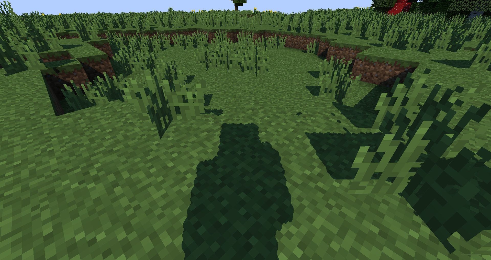
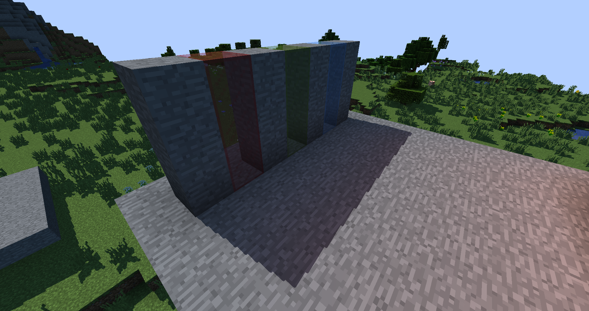
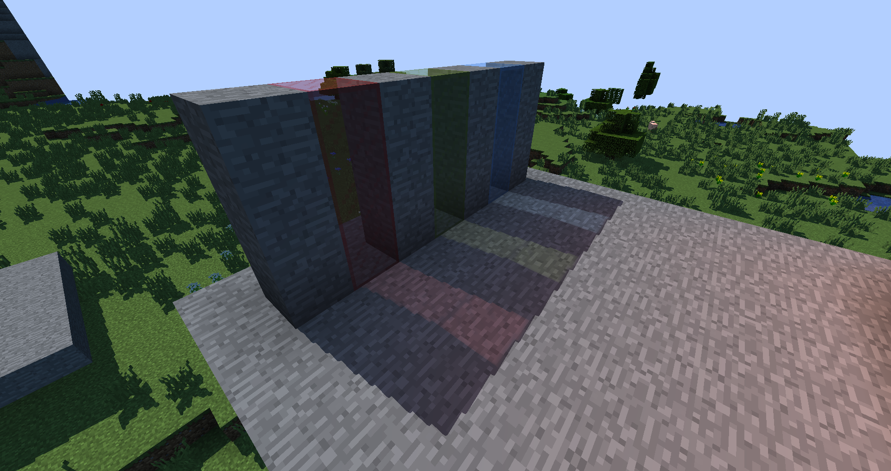
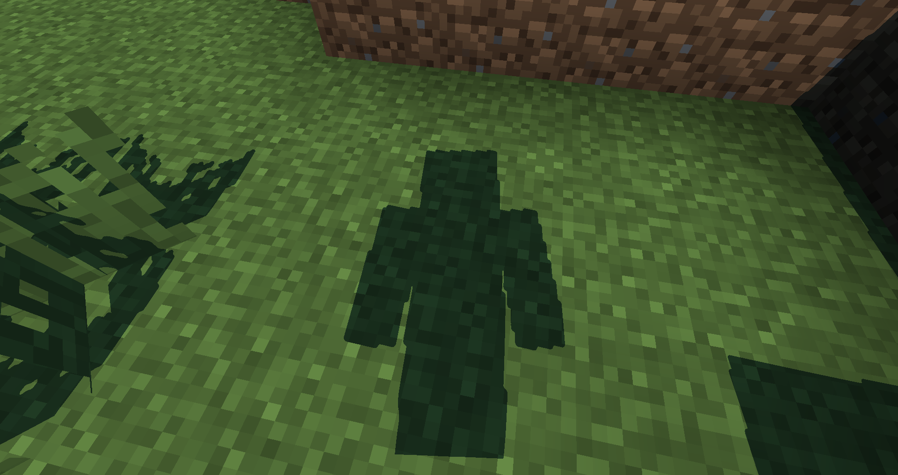
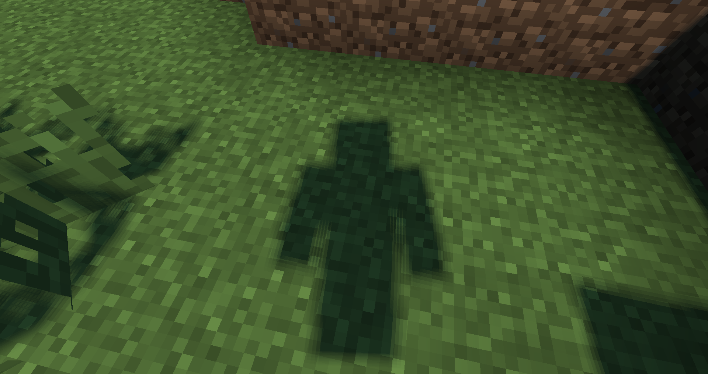

# Tutorial 4

In this tutorial I will make our shadows look actually good. I will be covering things like PCF, shadow distortion, and transparent shadows.

## Fixing the low detailed shadows problem

Continuing from the last tutorial, our shadows still look blocky. There is a fix to this. We can use a technique known as shadow distortion. In a nutshell, what shadow distortion does is distort the shadow clip space verticies in a way that verticies close to the center become bigger while ones far away become smaller. The advantage of this is that the space on the shadow map gets used more effectively. For those of you who know what cascaded shadow mapping is, think of shadow distortion being a super lazy alternative that only requires one shadow pass instead of N cascades number of passes.

Let's look at the equations for shadow distortion. We first need to calculate distance of a vertex from the center of clip space, which is (0, 0). This can be done simply with the pythagorean theorem.


Where `x` and `y` are the `x` and `y` coordinates of the vertex. From this we can calculate how strong we want to distort the verticies using a simple mix function:


Where `a` is how strong distortion is overall and `f` is the distortion factor. We use `a = 0.9`. Then we can transform the vertex like so:


Where `p` is the input vertex position in `xy` terms and `p′` is the transformed output vertex, which is also `xy`.

### Include directive

Before we implement it in code, we should know of how the include directive works. If we were to implement it without the use of the include directive, we would need to have the distortion equations in both `shadow.vsh` and `composite.fsh`. It is a lot easier to have them in one file. Note to the reader: include directives don't work like how they usually work in C/C++. `#include "path"` is a relative include and `#include "/path"` is relative to you `shaders` folder.

### The Implementation

I put my distortion code in a file called `distort.glsl`. Here is the distortion equations in code.

```glsl
vec2 DistortPosition(in vec2 position){
    float CenterDistance = length(position);
    float DistortionFactor = mix(1.0f, CenterDistance, 0.9f);
    return position / DistortionFactor;
}
```

In both `shadow.vsh` and `composite.fsh`, right after the version preprocessor directive, we include `distort.glsl` like so:

```glsl
#include "distort.glsl"
```

In `shadow.vsh` we distort the vertex like this:

```glsl
gl_Position    = ftransform();
gl_Position.xy = DistortPosition(gl_Position.xy);
```

And in `composite.fsh`, right before moving the shadow space sample coordiante to the [0, 1] range from the [-1, 1] range, we do this:

```glsl
ShadowSpace.xy = DistortPosition(ShadowSpace.xy);
vec3 SampleCoords = ShadowSpace.xyz * 0.5f + 0.5f;
```

If we reload our shader, our shadows will start to look much nicer:



## Transparent shadows

If we look at images in which case light it passing through transparent objects like stained glass, we notice that the shadows aren't colored and the stained glass acts if it was opaque.



We can fix this by using the shadow color textures. There are two shadow color textures: `shadowcolor0` and `shadowcolor1`. The shadow pass automatically writes to these textures. We will write the diffuse albedo to them. To do that we need to pass the texture coordinates and biome color from the shadow vertex shader to the shadow fragment shader:

`shadow.vsh`:

```glsl
#version 120

#include "distort.glsl"

varying vec2 TexCoords;
varying vec4 Color;

void main(){
    gl_Position    = ftransform();
    gl_Position.xy = DistortPosition(gl_Position.xy);
    TexCoords = gl_MultiTexCoord0.st;
    Color = gl_Color;
} Color = gl_Color;
```

And in `shadow.fsh`:

```glsl
#version 120

varying vec2 TexCoords;
varying vec4 Color;

uniform sampler2D texture;

void main() {
    gl_FragData[0] = texture2D(texture, TexCoords) * Color;
}
```

Then in `composite.fsh`, we declare two new samplers:

```glsl
uniform sampler2D shadowtex1;
uniform sampler2D shadowcolor0;
```

`shadowtex1` is like `shadowtex0` except it does not contain any transparent objects. The same rule applies to `depthtex*`. `shadowcolor0` is the shadow color texture we wrote to earlier. Let's reorganize our shadow mapping code and implement two new functions:

```glsl
float Visibility(in sampler2D ShadowMap, in vec3 SampleCoords) {
    return step(SampleCoords.z - 0.001f, texture2D(ShadowMap, SampleCoords.xy).r);
}

vec3 TransparentShadow(in vec3 SampleCoords){
    [...]
}

vec3 GetShadow(float depth) {
    vec3 ClipSpace = vec3(TexCoords, depth) * 2.0f - 1.0f;
    vec4 ViewW = gbufferProjectionInverse * vec4(ClipSpace, 1.0f);
    vec3 View = ViewW.xyz / ViewW.w;
    vec4 World = gbufferModelViewInverse * vec4(View, 1.0f);
    vec4 ShadowSpace = shadowProjection * shadowModelView * World;
    ShadowSpace.xy = DistortPosition(ShadowSpace.xy);
    vec3 SampleCoords = ShadowSpace.xyz * 0.5f + 0.5f;
    return TransparentShadow(SampleCoords);
}
```

`Visibility` returns whether a fragment is visible at `SampleCoords` using shadow map `ShadowMap`. `TransparentShadow` uses this function. Let's look at it's implementation:

```glsl
vec3 TransparentShadow(in vec3 SampleCoords){
    float ShadowVisibility0 = Visibility(shadowtex0, SampleCoords);
    float ShadowVisibility1 = Visibility(shadowtex1, SampleCoords);
    vec4 ShadowColor0 = texture2D(shadowcolor0, SampleCoords.xy);
    vec3 TransmittedColor = ShadowColor0.rgb * (1.0f - ShadowColor0.a); // Perform a blend operation with the sun color
    return mix(TransmittedColor * ShadowVisibility1, vec3(1.0f), ShadowVisibility0);
}
```

We first sample the visibility from both shadow depth textures. We also sample the block color from the shadow color texture. The block color includes the transparency value in `ShadowColor0.a`. We then compute how much of the light will be transparent if there is no opaque object:

```glsl
vec3 TransmittedColor = ShadowColor0.rgb * (1.0f - ShadowColor0.a); // Perform a blend operation with the sun color
```

After that, we return `TransmittedColor` if there is no opaque object. If we reload the shader, we get something that looks a bit like this:



## Soft Shadows

If we look at our shadows right now, we will notice that they look hard, instead of soft, which is both visually unappealing and unrealistic.



We can fix this by using a technique called percentage close filtering, or PCF for short. PCF averages results for the shadow query in areas around and on top of teh fragment instead of just on it. It isn't too hard to implement:

```glsl
#define SHADOW_SAMPLES 2
const int ShadowSamplesPerSize = 2 * SHADOW_SAMPLES + 1;
const int TotalSamples = ShadowSamplesPerSize * ShadowSamplesPerSize;

vec3 GetShadow(float depth) {
    [...]
    vec3 ShadowAccum = vec3(0.0f);
    for(int x = -SHADOW_SAMPLES; x <= SHADOW_SAMPLES; x++){
        for(int y = -SHADOW_SAMPLES; y <= SHADOW_SAMPLES; y++){
            vec2 Offset = vec2(x, y) / shadowMapResolution;
            vec3 CurrentSampleCoordinate = vec3(SampleCoords.xy + Offset, SampleCoords.z);
            ShadowAccum += TransparentShadow(CurrentSampleCoordinate);
        }
    }
    ShadowAccum /= TotalSamples;
    return ShadowAccum;
}
```

It looks like this:



We can still see "lines" since each sample gets average evenly. We can do complex tricks like bilinear filtering to get rid of the issue, but we can also do simpler things like applying a random rotation to the offset. Optifine provides a noise texture called `noisetex` for linear sampling of random noise. The resolution for `noisetex` can be set like this:

```glsl
const int noiseTextureResolution = 128; // Default value is 64
```

We can sample from `noisetex` to get an angle, which we can use to create a random rotation:

```glsl
[...]
float RandomAngle = texture2D(noisetex, TexCoords * 20.0f).r * 100.0f;
float cosTheta = cos(RandomAngle);
float sinTheta = sin(RandomAngle);
mat2 Rotation =  mat2(cosTheta, -sinTheta, sinTheta, cosTheta) / shadowMapResolution; // We can move our division by the shadow map resolution here for a small speedup
for(int x = -SHADOW_SAMPLES; x <= SHADOW_SAMPLES; x++){
    for(int y = -SHADOW_SAMPLES; y <= SHADOW_SAMPLES; y++){
        vec2 Offset = Rotation * vec2(x, y);
        [...]
    }
}
```

And here are the results:


These shadows are much more smoother and much more visually appealing.

## Going further

Realistically nobody should use a box kernel for shadow mapping. It's hard to control and sample counts increate rapidly. It also doesn't look too good in certain cases. However, it is possible to throw out a box filter for a spherical filter. These types of methods use a vogel or poisson disk to sample the shadows. I'll leave this as an exercise to the reader to research and implement these sampling methods.
